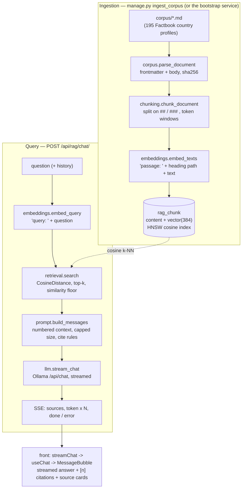

# Architecture

EasyRag is a retrieval-augmented-generation demo: a fixed corpus, indexed into
pgvector, answered by a local LLM that cites its passages. Everything runs
locally — no external API.

- **Backend** — Django 6 + DRF (`core/`, `apps/rag/`). One public endpoint.
- **Frontend** — React Router v8 framework mode (`front/`).
- **Storage** — PostgreSQL + [pgvector](https://github.com/pgvector/pgvector).
- **Models** — `sentence-transformers` (`intfloat/multilingual-e5-small`, 384-dim) for embeddings, [Ollama](https://ollama.com) (`llama3.2:3b`) for generation.
- **Auth** — none. The chat endpoint is open; `django.contrib.auth` + the admin are kept only for `createsuperuser` / inspecting `Document` / `Chunk`.

## Data flow

## Query path, step by step

1. **`apps/rag/views.ChatView`** (`POST /api/rag/chat/`) — public, `ScopedRateThrottle` (`rag_chat`, 20/min per IP). Validates `{question, history?}` (`serializers.ChatRequestSerializer`, history capped at 10 turns), returns a `StreamingHttpResponse` of `text/event-stream`.
2. **`services/retrieval.search(question)`** — `embeddings.embed_query` prefixes the text with `query: ` and encodes it; then `Chunk.objects.annotate(distance=CosineDistance("embedding", v)).order_by("distance")[:RAG_TOP_K]`, keeping rows at least `RAG_SIMILARITY_THRESHOLD` similar. Returns `RetrievedChunk` (chunk + distance + similarity).
3. **`services/prompt.build_messages`** — a grounding system prompt, optional history, then a user turn with numbered context blocks (`[1] <heading path>\n<text>`). `format_context` caps the passage text at `RAG_PROMPT_CONTEXT_CHARS` so the CPU model isn't stuck prefilling thousands of tokens — retrieval still returned every chunk for the UI.
4. **`services/llm.stream_chat`** — POSTs to `{OLLAMA_URL}/api/chat` with `stream: true` and `keep_alive`; yields `message.content` tokens; every failure (unreachable, non-200, an in-stream `error` frame, bad JSON) raises `OllamaError`.
5. **`views.ChatView._events`** — emits `event: sources` first (retrieval is done), then `event: token` per token, then `event: done`; an `OllamaError` or retrieval failure becomes `event: error` (terminal).
6. **Frontend** — `features/chat/api.streamChat` parses the SSE by hand (`EventSource` can't POST) and resolves with a `StreamResult` (`done` / `aborted` / `incomplete` / `error{kind}`). `features/chat/hooks.useChat` owns the message list and the send / stop / retry lifecycle. `features/chat/message.MessageBubble` renders the streamed text, turns `[n]` markers into buttons that scroll to the matching `SourceCard`.

## Ingestion path

`manage.py ingest_corpus` (also run by the `bootstrap` compose service):

1. `services/corpus.iter_corpus` walks `corpus/*.md`, `parse_document` extracts YAML frontmatter (`title` + arbitrary metadata) and computes a sha256 of the normalised text.
2. A `Document` whose `source_path` + `content_hash` are unchanged is skipped; otherwise its chunks are dropped and it's re-processed.
3. `services/chunking.chunk_document` splits the body on `##` / `###` headings (never merging across one), packs each section into `RAG_CHUNK_TOKENS`-ish windows with `RAG_CHUNK_OVERLAP`, and records the heading path per chunk.
4. `services/embeddings.embed_texts` embeds each chunk as `passage: <heading path>\n\n<content>` — the heading path is what tells the model the chunk is about e.g. *Nepal > Geography* when the text itself never says so.
5. `Chunk` rows are `bulk_create`d with their `vector(384)` embedding. The HNSW cosine index (`rag/migrations/0002`) is created on PostgreSQL only.

Swapping corpora: replace the files under `corpus/` (see [`corpus-format.md`](corpus-format.md)), run `ingest_corpus --reset`.

## Key files

| Area | File |
|---|---|
| Models | `apps/rag/models.py` — `Document`, `Chunk` (pgvector `VectorField`) |
| Migrations | `0001_initial` (VectorExtension + tables), `0002` (HNSW index) |
| Corpus reading | `apps/rag/services/corpus.py` |
| Chunking | `apps/rag/services/chunking.py` |
| Embeddings | `apps/rag/services/embeddings.py` (lazy model, preloaded via `core/wsgi.py`) |
| Retrieval | `apps/rag/services/retrieval.py` |
| Prompt | `apps/rag/services/prompt.py` |
| Ollama client | `apps/rag/services/llm.py` |
| Endpoint | `apps/rag/views.py`, `apps/rag/serializers.py`, `apps/rag/urls.py` |
| Ingestion command | `apps/rag/management/commands/ingest_corpus.py` |
| Corpus + adapter | `corpus/*.md`, `scripts/adapters/factbook.py` |
| First-boot | `scripts/bootstrap.sh`, `docker-compose.yml` (`bootstrap` service) |
| Frontend chat | `front/app/features/chat/`, `front/app/routes/chat.tsx` |
| Landing | `front/app/routes/home.tsx` |

## Settings (`core/settings.py`, all `RAG_*` / `OLLAMA_*` overridable via env)

| Setting | Default | Notes |
|---|---|---|
| `RAG_EMBEDDING_MODEL` | `intfloat/multilingual-e5-small` | must be 384-dim (baked into the `Chunk.embedding` column) |
| `RAG_EMBEDDING_QUERY_PREFIX` / `_PASSAGE_PREFIX` | `query: ` / `passage: ` | e5 needs prefixed inputs; set empty for models that don't |
| `RAG_CHUNK_TOKENS` / `RAG_CHUNK_OVERLAP` | 350 / 64 | approximate — `estimate_tokens` is a heuristic, e5's window is 512 |
| `RAG_TOP_K` | 8 | chunks retrieved (and shown as source cards) |
| `RAG_SIMILARITY_THRESHOLD` | 0.72 | a floor only — e5 similarities sit in a narrow high band; real precision would need hybrid search |
| `RAG_PROMPT_CONTEXT_CHARS` | 2800 | caps what the LLM prefills (~750 tokens ≈ 12s to first token on CPU) |
| `RAG_LLM_MODEL` | `llama3.2:3b` | Ollama model |
| `OLLAMA_KEEP_ALIVE` | `-1` | keep the model resident (a cold reload is ~15-25s) |
| `OLLAMA_CONNECT_TIMEOUT` / `OLLAMA_READ_TIMEOUT` | 5 / 120 | the read timeout must tolerate slow CPU generation |

## Design notes

- **Heading-path embedding** was the single biggest retrieval-quality lever — chunk text rarely repeats the country or section, so embedding `heading_path + content` is what makes narrow lookups ("terrain of Nepal") land on the right country.
- **Generic pipeline, isolated adapter** — `chunking` / `ingest_corpus` know nothing about the Factbook. `scripts/adapters/factbook.py` is the only source-specific code; its output is the plain Markdown format in `corpus-format.md`.
- **CPU-first** — the model is baked into the backend image (`HF_HUB_OFFLINE`), preloaded at startup (`--preload`), the LLM stays resident, and the prompt context is capped. First token is ~10-12s on CPU; a GPU or hosted model is a deployment choice.
- **gthread gunicorn** — the SSE response is held open for the whole generation; the default sync worker's 30s timeout would kill it.
